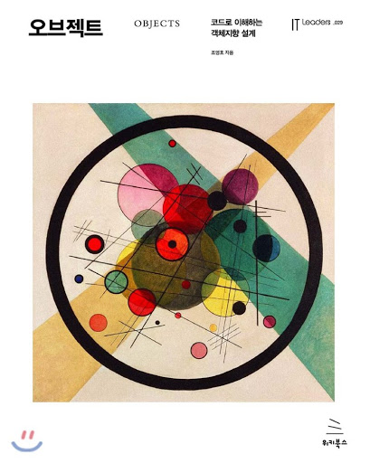

# object-study

  
  
# 1장 정리
1. https://github.com/seongjin605/object.study/tree/master/src/main/java/com/obj/study/_01/_01_ticket
2. https://github.com/seongjin605/object.study/tree/master/src/main/java/com/obj/study/_01/_02_ticket
> 테스트 코드: https://github.com/seongjin605/object.study/blob/master/src/test/java/com/obj/study/_01/_01_ticket/TicketTest.java