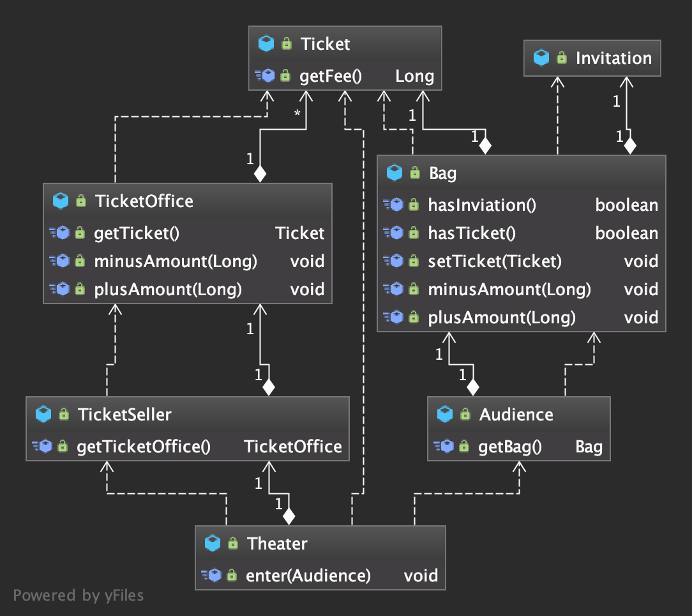

#  

* **로버트 마틴의 소프트웨어 모듈의 세가지 목적(클린 소프트웨어 저자)**
1. 런타임중에 제대로 동작해야한다.  
2. 변경을 위한 존재(대부분의 모듈은 생명주기 동안 변경되기 때문에 간단한 작업만으로도 변경이 가능해야한다.)  
3. 코드를 읽는 사람과 의사소통을 해야한다.(가독성 측면에서 다른 개발자가 와도 쉽게 이해할 수 있어야함.)  

#  

객체사이에 의존성이 과한 경우를 가르켜 **결합도(coupling)** 가 높다고 한다.   
예제 코드는 로버트 마틴이 주장한 세 가지 중 한가지만 만족하며(1번), 다른 두가지 조건(2번, 3번)은 만족시키지 못한다.  
그래서 변경과 소통의 문제가 발생 할 수 있는데, 우선 Theater 같은 경우 관람객의 가방과 판매원의 매표소에 직접 접근 가능한 구조이다.  
이것은 관람객과 판매원이 직접 자신의 일을 스스로 처리해야 한다는 각 객체의 입장의 관점에서 벗어난 코드다.  
 결국 개발자는 사람이기 때문에 기계적 관점이 아닌 사람과 사람 사이에서 이해 할 수 있는 코드를 구현해야한다.  

