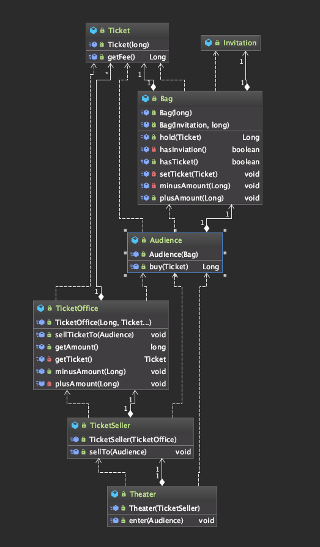

첫번째 _01_ticket 패키지내의 ticket 시스템 설계가 가독성이 떨어지는 이유는 Theater가 관람객의 가방과 판매원의  
매표소에 직접 접근하기 때문이다. 왜냐하면 관람객과 판매원은 자신의 일을 스스로 능동적으로 처리해야한다는 사람의 직관에 벗어난다.  

  
### 관람객과 판매원을 자율적인 존재로 만들어보자.  

  

* 기존의 _01_ticket 패키지안의 Theater 클래스

```java
public class Theater {
    public void enter(Audience audience) {
        if(audience.getBag().hasInviation()) {
            Ticket ticket = ticketSeller.getTicketOffice().getTicket();
            audience.getBag().setTicket(ticket);
        } else {
            Ticket ticket = ticketSeller.getTicketOffice().getTicket();
            audience.getBag().minusAmount(ticket.getFee());
            ticketSeller.getTicketOffice().plusAmount(ticket.getFee());
            audience.getBag().setTicket(ticket);
        }
    }
}
```
위 코드의 문제점은 Theater가 Audience와 TicketSellet 및 Audience 소유의 Bag과 TicketOffice까지  
마음대로 접근하기 때문에 Audience와 TicketSeller가 직접 Bag과 TicketOffice를 처리하는 자율적인 존재가되야한다.  

  
  


TicketSeller가 자율적인 존재가되어 enter() 메서드내에 있는 행위를 처리하게 변경한다.  
```java
public class TicketSeller {
    public void sellTo(Audience audience) {
        if(audience.getBag().hasInviation()) {
            Ticket ticket = ticketSeller.getTicketOffice().getTicket();
            audience.getBag().setTicket(ticket);
        } else {
            Ticket ticket = ticketSeller.getTicketOffice().getTicket();
            audience.getBag().minusAmount(ticket.getFee());
            ticketSeller.getTicketOffice().plusAmount(ticket.getFee());
            audience.getBag().setTicket(ticket);
        }
    }
}

------------------------------------------------------------------------

public class Theater {
    public void enter(Audience audience) {
        ticketSeller.sellTo(audience);
    }
}
```
변경을 했지만, TicketSeller는 Audience의 getBag() 메서드를 호출해서 Audience 내부의  
Bag 인스턴스에 접근한다. Bag 인스턴스에 접근하는 객체가 Theater에서 TicketSeller로 변경이  
되었을 뿐 여전히 Audience는 자율적인 존재가 아니다.  
  
  
  

```java
public class Audience {
    public Long buy(Ticket ticket) {
        if(bag.hasInvitation()) {
            bag.setTicket(ticket);
            return 0L;
        } else {
            bag.setTicket(ticket);
            bag.minusAmount(ticket.getFee());
            return ticket.getFee();
        }
    }
}

------------------------------------------------------------------------

public class TicketSeller {
    public void sellTo(Audience audience) {
        ticketOffice.plusAmount(audience.buy(ticketOffice.getTicket()));
    }
}
```
Audience는 자율적이고 능동적인 존재가 되었지만, Bag도 자율적인 존재로 만들어보자.  

  


```java
public class Bag {
    public Long hold(Ticket ticket) {
        if(hasInvitation()) {
            setTicket(ticket);
            return 0L;
        } else {
            setTicket(ticket);
            minusAmount(ticket.getFee());
            return ticket.getFee();
        }
    }
}

------------------------------------------------------------------------

public class Audience {
    public Long buy(Ticket ticket) {
        return bag.hold(ticket);
    }
}
```

  


TicketSeller는 현재 TicketOffice에 있는 Ticket을 마음대로 꺼내서 자기 멋대로 Audience에 팔고,  
마음대로 TicketOffice에 판매금액을 넣어버린다.  
TicketOffice에 sellTicketTo() 메서드를 만들고 TicketSeller sellTo 메서드내에서 호출한다
```java
public class TicketOffice {
    public void sellTicketTo(Audience audience) {
        plusAmount(audience.buy(getTicket()));
    }
}

------------------------------------------------------------------------

public class TicketSeller {
    public void sellTo(Audience audience) {
        // ticketOffice.plusAmount(audience.buy(ticketOffice.getTicket()));
        ticketOffice.sellTicketTo(audience);
    }
}
```


연관된 작업만을 수행하고 연관성 없는 작업은 다른 객체에게 위임하는 객체를 가르켜 응집도(cohesion)이 높다고한다.  
변경하기 쉬운 설계는 한 번에 하나의 클래스만 변경할 수 있는 설계이다.  
또한, 하나의 변경으로인한 여파로 다른 여러 클래스에 에러가 전파되는 것을 억제해야한다.  

  


레베카 워프스브록은 이처럼 능동적이고 자율적인 존재로 소프트웨어르 객체를 설계하는 원칙을 가르켜
**의인화(anthropomorphism)**이라고 한다.

  


